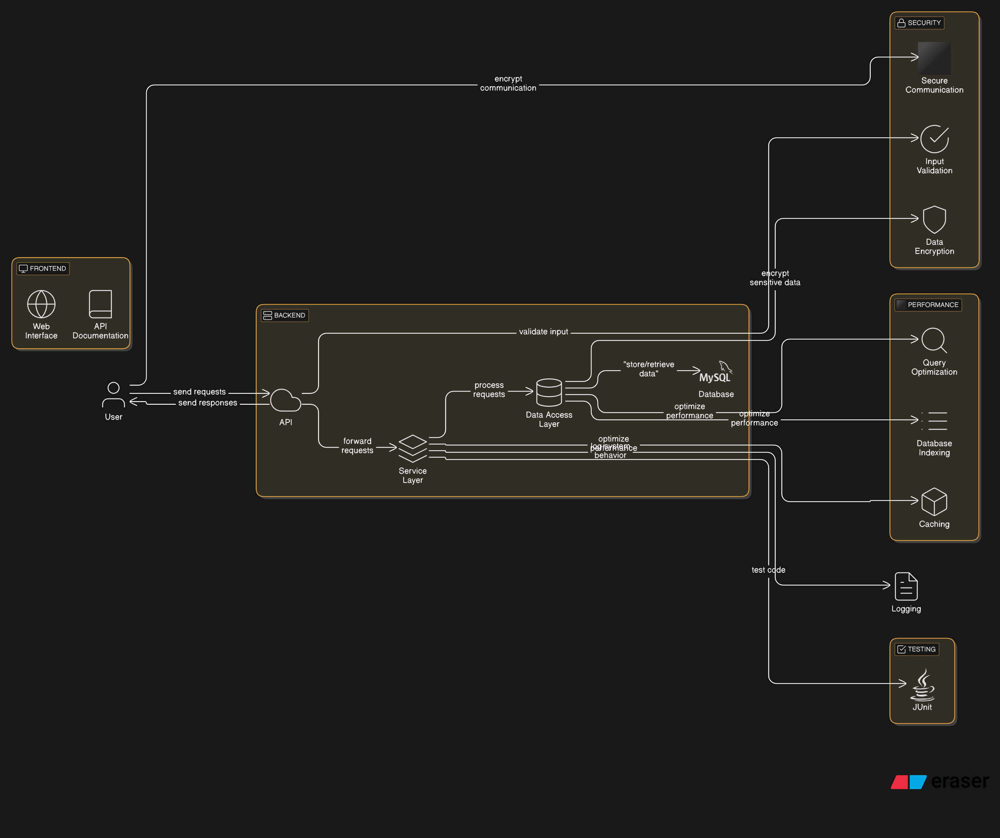

## Book Store Application with Spring Boot and Redis

This repository implements a sample Book Store application built with Spring Boot and Redis. The application offers RESTful APIs for managing books, authors, categories, and orders. It incorporates features like user authentication, role-based access control, request validation, caching, and Redis integration.

### Table of Contents

- [Book Store Application with Spring Boot and Redis](#book-store-application-with-spring-boot-and-redis)
  - [Table of Contents](#table-of-contents)
- [Project Structure](#project-structure)
- [Getting Started](#getting-started)
- [API Documentation](#api-documentation)
- [Features](#features)
- [Testing](#testing)
- [Deployment](#deployment)

## Project Structure

Here's a breakdown of the project structure:

```
bookstore/
├── src/main/java/com/example/bookstore/
│   ├── config/ (Configuration files)
│   ├── controller/ (REST API controllers)
│   ├── dto/ (Data Transfer Object classes)
│   ├── entity/ (Entity classes for database models)
│   ├── exception/ (Custom exception classes)
│   ├── repository/ (Database access repositories)
│   ├── security/ (Security configuration classes)
│   ├── service/ (Business logic services)
│   └── BookstoreApplication.java (Main application class)
├── src/main/resources/
│   ├── application.properties (Application configuration)
│   ├── static/ (Static content for the application)
│   └── templates/ (Templates for UI if applicable)
├── pom.xml (Project dependencies)
└── README.md (This file)
```

## Getting Started

1. **Clone the Repository:**

   ```bash
   git clone https://github.com/your-username/bookstore.git
   ```

2. **Navigate to the Project Directory:**

   ```bash
   cd bookstore
   ```

3. **Install Dependencies:**

   ```bash
   mvn clean install
   ```

4. **Configure Database Connection (application.properties):**

   ```properties
   spring.datasource.url=jdbc:mysql://localhost:3306/bookstore?useSSL=false&serverTimezone=UTC
   spring.datasource.username=your_username
   spring.datasource.password=your_password
   ```

5. **Run the Application:**

   ```bash
   mvn spring-boot:run
   ```

## API Documentation

Access the API documentation at `http://localhost:8080/swagger-ui.html`.

## Features

**User Authentication:**

The application leverages Spring Security for user authentication, supporting both basic authentication and JWT (JSON Web Tokens) authentication.

**Role-Based Access Control:**

Spring Security implements role-based access control. Users can have roles like ADMIN or USER, granting access to specific resources based on their assigned roles.

**Request Validation:**

Spring Validation validates incoming request payloads. You can add validation annotations (e.g., `@NotNull`, `@Size`, `@Pattern`) to your DTO classes.

**Caching:**

Spring Cache facilitates caching frequently accessed data. Annotate methods with `@Cacheable` to cache results and `@CacheEvict` to invalidate the cache upon data updates.

**Redis Integration:**

The application integrates Redis for caching and session management.

* **Redis Caching:** Add the `spring-boot-starter-data-redis` dependency to your `pom.xml`. Configure Redis in `application.properties`:

   ```properties
   spring.redis.host=localhost
   spring.redis.port=6379
   ```

* **Redis Session Management:** Add the `spring-session-data-redis` dependency to your `pom.xml`. Configure Redis session management in `application.properties`:

   ```properties
   spring.session.store-type=redis
   spring.session.redis.flush-mode=on_save
   spring.session.redis.timeout=60s
   ```

## Testing

The application utilizes JUnit and Mockito for unit testing. Run the tests with:

```bash
mvn test
```

## Deployment

For deployment, build a JAR file using Maven and then run it using the Java command.

1. **Build JAR File:**

   ```bash
   mvn clean package
   ```

2. **Run JAR File:**

   ```bash
   java -jar target/bookstore-0.0.1-SNAPSHOT.jar
   ```

Alternatively, deploy in Containerized environments (Docker, Kubernetes).


